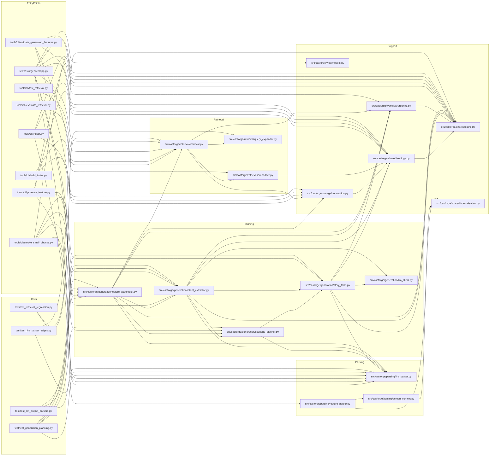

```mermaid
flowchart LR
  subgraph Parsing
    jira_parser["src/casforge/parsing/jira_parser.py"]
    feature_parser["src/casforge/parsing/feature_parser.py"]
    screen_context["src/casforge/parsing/screen_context.py"]
  end

  subgraph Planning
    llm_client["src/casforge/generation/llm_client.py"]
    story_facts["src/casforge/generation/story_facts.py"]
    scenario_planner["src/casforge/generation/scenario_planner.py"]
    intent_extractor["src/casforge/generation/intent_extractor.py"]
    feature_assembler["src/casforge/generation/feature_assembler.py"]
  end

  subgraph Retrieval
    retrieval["src/casforge/retrieval/retrieval.py"]
    embedder["src/casforge/retrieval/embedder.py"]
    query_expander["src/casforge/retrieval/query_expander.py"]
  end

  subgraph Support
    storage_connection["src/casforge/storage/connection.py"]
    ordering["src/casforge/workflow/ordering.py"]
    shared_paths["src/casforge/shared/paths.py"]
    shared_settings["src/casforge/shared/settings.py"]
    shared_normalisation["src/casforge/shared/normalisation.py"]
    web_models["src/casforge/web/models.py"]
  end

  subgraph EntryPoints
    cli_generate["tools/cli/generate_feature.py"]
    cli_ingest["tools/cli/ingest.py"]
    cli_validate["tools/cli/validate_generated_features.py"]
    cli_build_index["tools/cli/build_index.py"]
    cli_smoke["tools/cli/smoke_small_chunks.py"]
    cli_evaluate["tools/cli/evaluate_retrieval.py"]
    cli_test_retrieval["tools/cli/test_retrieval.py"]
    web_app["src/casforge/web/app.py"]
  end

  subgraph Tests
    test_generation["test/test_generation_planning.py"]
    test_parser["test/test_jira_parser_edges.py"]
    test_llm["test/test_llm_output_parsers.py"]
    test_retrieval["test/test_retrieval_regression.py"]
  end

  feature_parser --> screen_context
  feature_parser --> shared_normalisation
  screen_context --> shared_normalisation

  shared_settings --> shared_paths
  storage_connection --> shared_settings
  embedder --> shared_settings
  ordering --> shared_paths

  retrieval --> embedder
  retrieval --> query_expander
  retrieval --> storage_connection
  retrieval --> ordering

  story_facts --> llm_client
  story_facts --> jira_parser
  story_facts --> shared_paths
  story_facts --> shared_settings
  story_facts --> ordering

  scenario_planner --> story_facts
  scenario_planner --> jira_parser

  intent_extractor --> llm_client
  intent_extractor --> story_facts
  intent_extractor --> scenario_planner
  intent_extractor --> jira_parser
  intent_extractor --> shared_paths
  intent_extractor --> shared_settings
  intent_extractor --> ordering

  feature_assembler --> intent_extractor
  feature_assembler --> scenario_planner
  feature_assembler --> jira_parser
  feature_assembler --> retrieval
  feature_assembler --> storage_connection
  feature_assembler --> shared_paths
  feature_assembler --> ordering

  cli_generate --> jira_parser
  cli_generate --> intent_extractor
  cli_generate --> feature_assembler
  cli_generate --> shared_paths
  cli_generate --> shared_settings

  cli_ingest --> feature_parser
  cli_ingest --> storage_connection
  cli_ingest --> shared_paths
  cli_ingest --> shared_settings

  cli_validate --> retrieval
  cli_validate --> storage_connection
  cli_validate --> shared_paths
  cli_validate --> shared_settings

  cli_build_index --> embedder
  cli_build_index --> storage_connection

  cli_smoke --> feature_assembler
  cli_smoke --> scenario_planner
  cli_smoke --> story_facts
  cli_smoke --> jira_parser
  cli_smoke --> shared_paths

  cli_evaluate --> retrieval
  cli_test_retrieval --> retrieval

  web_app --> feature_assembler
  web_app --> intent_extractor
  web_app --> jira_parser
  web_app --> retrieval
  web_app --> shared_paths
  web_app --> shared_settings
  web_app --> ordering
  web_app --> web_models

  test_generation --> feature_assembler
  test_generation --> scenario_planner
  test_generation --> intent_extractor
  test_generation --> story_facts
  test_generation --> jira_parser

  test_parser --> jira_parser
  test_parser --> shared_paths

  test_llm --> feature_assembler
  test_llm --> intent_extractor
  test_llm --> jira_parser

  test_retrieval --> retrieval
  test_retrieval --> query_expander
```
